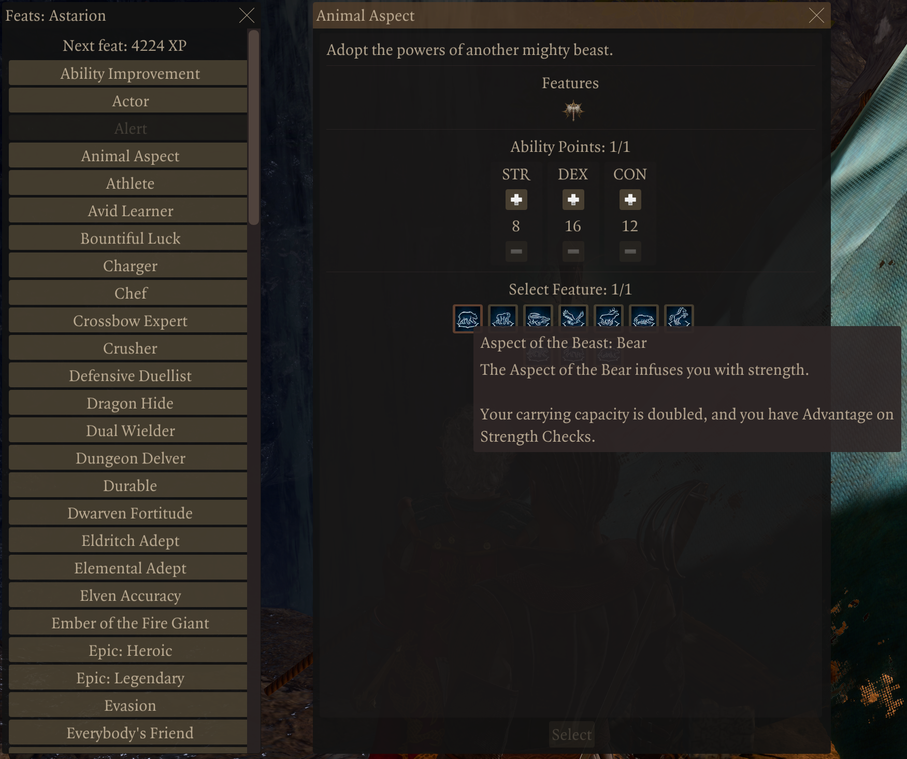
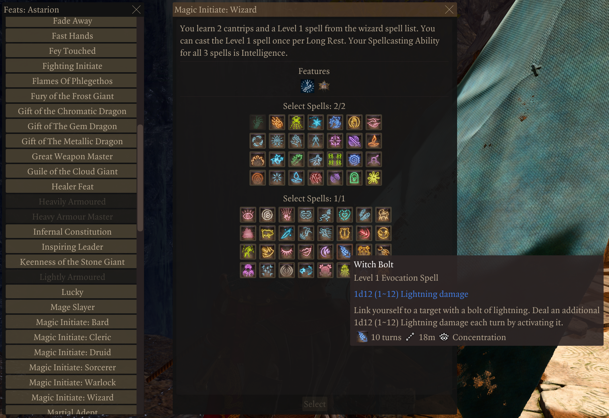
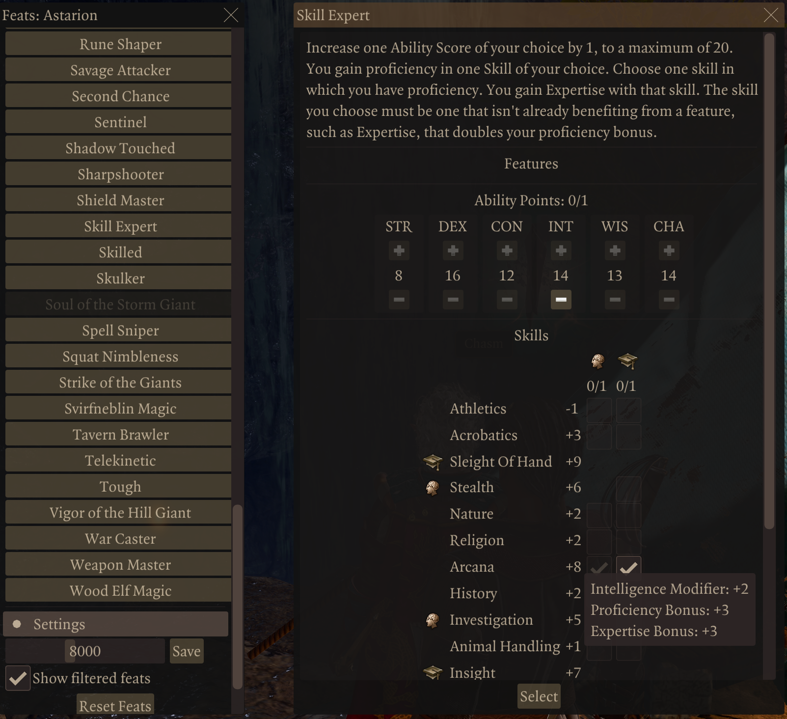

# Baldur's Gate 3 D&amp;D Epic 6 Mod

The mod is now live on Nexus Mods at: https://www.nexusmods.com/baldursgate3/mods/8133

## What is Epic 6?
D&amp;D Epic 6 limits level progression to 6th level (where power between casters and melee starts to diverge substantially). After which, at 8k experience (configurable), you earn a feat.

There are now additional variations to earn feats after level 12 and 20 level caps.

## Outline of Basic Method

I gather information about each feat dynamically at runtime. I examine features, abilities (and their constraints), and proficiencies. I then generate a list of feats the player can select and provide mechanisms for the player to select options for each feat.

To achieve this, a 'spell' is granted to each character that can level. This provides access to the feat-granting panel when the character has feat points. When the player does not, there are configuration and debug options that can be explored, such as changing the amount of experience per feat or displaying filtered feats (and their reasons).

The 'spell' is sent to the server (even in a single-player game, there is a server instance) that gathers all of the feats and player data to send back to the client. The client then uses imgui to render the selections.

### Basic Functionality

There are three core changes to gameplay to achieve Epic 6:
 * Cap levels to 6th level (this becomes more important when you encounter Jaheira and Minsc, who have starting levels in excess of 6).
 * Change the experience progression so 6th level is achievable, but 7th is not, providing a large range of experience to earn.
 * Monitor the progress of experience earned after 6th level to determine how many feat points ought to be granted (less feats already selected).

Tracking available feats uses the FeatPoint Action Resource.

Selected feats are stored in the character's Vars.E6_Feats variable. While granted passives are preserved during save and load, boosts are not. I use this list to regrant the boosts on load for the character. This information is also used to revoke feats before going through a character respec (and restoring them if the respec is cancelled).


### Granting Feats

The feat information is parsed for the various abilities and options it grants, and those are applied to the character. These manifest on the client side as a feat details panel that allows selection of feats, proficiencies, passives/features, and abilities.







## New and Altered Feats

I added several new feats and adjusted others.

The most common tweaks for existing feats were to make them repeatable (such as Resilient) and/or add a class tag. This enables dialogue in the game usually reserved for another class. If you were a wizard Magic Initiate, getting the Wizard tag seemed reasonable, for example.

There is an interesting problem with new feats. The only supported requirements for feats are those Larian implemented. New feats can add additional requirements, but they will be ignored. As such, many of these feats will appear at level 4 feat selection, unintentionally. I suspect this behaviour is because reporting to the user that a feat is blocked from usage requires localization text strings, and the requirements system doesn't have a mechanism to indicate both that the requirement isn't met and the localization message for it.

New Feats:
 * **Epic: Heroic**: This increases your proficiency bonus by 1. Note: Some feats that use the proficiency bonus for the amount of an action resource available may not honour this value.
 * **Epic: Legendary**: Increase the maximum for one stat to 24, and another to 22 (you don't want to do the same stat for both, as it will only take the better of the two). Note: some feats set an explicit limit that Legendary won't work for.
 * **Avid Learner**: Select two skills for expertise and get a class tag.
 * **Aspect of the Beast**: Grant a barbarian animal aspect, an ability boost (strength, dexterity, or constitution), and the barbarian class tag.
 * **Natural Explorer**: Grant a ranger region of exploration, an ability boost (strength, dexterity, or wisdom), and the ranger class tag.
 * **Evasion**: Gain the rogue's evasion ability (dexterity save for no damage, failure for 1/2), and the rogue class tag.
 * **Fast Hands**: An additional bonus action and the rogue class tag.
 * **Potent Cantrip**: Cantrip saving throws still deal 1/2 damage, plus a spellcaster class tag.
 * **Potent Spellcasting**: Cantrip damage can be increased by one of your intelligence, wisdom, or charisma modifier. Select a spellcaster class tag.

## Commands

I moved the buttons for exporting the character (either in general or Epic 6 data) to commands. I have also added a few others:
 * `!E6_ExportCharacter <characterid>`: Exports the character to "%LOCALAPPDATA%\Larian Studios\Baldur's Gate 3\Script Extender\\&lt;character name&gt;-Character-Export.json"
 * `!E6_ExportEpicSix <characterid>`: Exports the character to "%LOCALAPPDATA%\Larian Studios\Baldur's Gate 3\Script Extender\\&lt;character name&gt;-EpicSix-Export.json"
 * `!E6_DumpParty <characterid>`: Dumps the party view to the console, including summons and their levels.
 * `!E6_FixParty <characterid>`: Attempts to change the party's available and eoc levels if they exceed six. However, it has no effect on summons and numerous other entities that can be followers. Kept for sample code (or if I want to experiement further later).
 * `!E6_TestXPCalc`: Runs a basic test with known numbers and expected results to ensure the calculations work.
 * `!E6_GetFeatCount [<xp>] [<xp per feat>] [<xp per feat delta>]`: Calculates the number of feats based on the experience, the xp per feat, and the xp per feat delta. If xp isn't provided, it will get it from the current character. If the latter two aren't provided, it will retrieve the values from the current settings.

Note: You can get &lt;characterid&gt; from using `_P(GetHostCharacter())` in the console.

Example Output from !E6_GetFeatCount:
```
S >> !E6_GetFeatCount
E6[Server]: XP=230731, XP/feat=5000, XP/feat delta=500, feat count=22, XP required for next feat: 10769
S >> !E6_GetFeatCount 230731 5000 1000
E6[Server]: XP=230731, XP/feat=5000, XP/feat delta=1000, feat count=17, XP required for next feat: 12269
```
