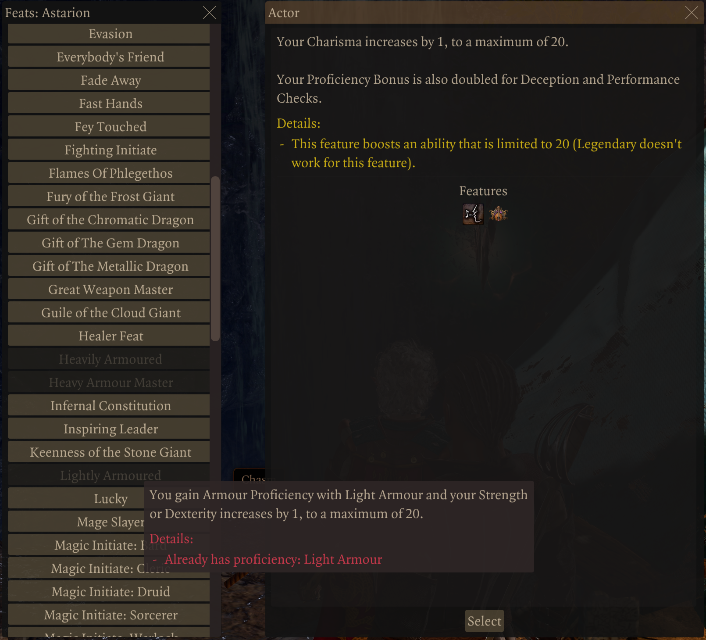

# Baldur's Gate 3 D&amp;D Epic 6 Mod

My current progress on creating the D&amp;D Epic 6 implementation for Baldur's Gate 3

## What is Epic 6?
D&amp;D Epic 6 limits level progressing to 6th level (where power between casters and melee start to diverge substantially). After which, at 5k experience, you earn a feat.

## Outline of Basic Method

Imgui is now available in the script extender and I'm revisiting this.

I gather information about each of the feats dynamically at runtime and process each. This results in more parsing than desired, but this works so far. I can bring up a couple of windows showing available feat options and selecting one will show the description and the option to select the feat.

The "spell" to select the option now is captured in server code, which gathers information about the player and sends a message to the client to show the UI. The client renders the UI with the provided data. The selection is sent back to the server which is stored as a feat object on the character's Vars.E6_Feats variable.

### Basic Functionality

Tick examines the party members and determine if they have reached level 6. If so, it determines how much experience has been earned and calculates the number of feats to grant. On granting the first feat point, the "spell" to select feat points is granted.

For testing purposes, the module changes the required amount of experience for levels and feats to a very small number.

Tracking available feats uses the FeatPoint Action Resource.

Tracking used feats is the character's Vars.E6_Feats variable.

Tick then uses the current experience of the character, computes what the feat points should be and then subtracts the used ones to determine whether there are any to grant. I would have preferred if there was an event to bind to when granted experience, but could not find one.

Respec is captured and the feats granted through this mechanism are removed (based on the information in the Vars.E6_Feats variable).

### Granting Feats

The feat information is parsed for the various abilities and options it grants, and those are applied to the character. Unlike the attempts to use spells and boosts which would automatically reset on respec, this method does not. I explicitly track the feats granted this way to be able to remove them on respec.

## Useful Resources

### Userdata to Json

I've written a helpful function for digging through information about the player character or other userdata structures (as that is a limitation for Ext.Json.Stringify--it cannot process userdata). The code is in https://github.com/FineRedMist/bg3_mod_epic6/blob/imgui/DnD-Epic6/Mods/DnD-Epic6/ScriptExtender/Lua/Shared/E6_Jsonify.lua and the function, E6_ToJson (slightly misnamed), uses breadth first search to generate the json. It has a second argument for the list of properties to skip recursing into to avoid dumping, say, other party members you aren't interested in, or the inventory of the character as it isn't something you are interested in.

This is accomplished (with some chagrin) by gathering all the @field entries in the ExtIdeHelpers and testing all of them against each userdata encountered.

Furthermore, the visited objects are tracked, and encountering the same object again will instead list the location where that entry can be found, such as:

	"SelectionType" : "Visited at: /AddedSpells/Spells[1]/LearningStrategy",

For example: 

    local obj = E6_ToJson(ent, {"Party", "ServerReplicationDependencyOwner", "InventoryContainer"})
    local str = Ext.Json.Stringify(obj)
    Ext.IO.SaveFile("E6_character.json", str)
    _P("Character saved!")
    
An example of a character exported this way is at: https://github.com/FineRedMist/bg3_mod_epic6/blob/imgui/References/E6_character.json

## Previous Attempts

These are the previous attempts that did not work.

### Dynamic Generation

My initial attempt at implementing this was in lua (seen under the https://github.com/FineRedMist/bg3_mod_epic6/tree/main/DnD-Epic6/Mods/DnD-Epic6/ScriptExtender/Lua/Dynamic folder). The problem was spells created entirely through lua using the script extender wouldn't enable targeting (https://github.com/Norbyte/bg3se/issues/339). Unfortunately, I had to shelve this method.

### Static Generation

Static generation is quite a bit more messy. Dynamic generation can query what is loaded and how and just generate on the fly. However, static generation has no insight into which modules are loaded and what is in each module. It has to gather the feats from the game that are present, and then any other mods that provide feats, and do so in such a way that if a mod is present or absent, things just work. Particularly when mods replace the implementation of an existing mod.

This required using the LSLib library to go through the game's pak files to extract information about modules, feats, feat descriptions, abilities, skills, spells, and data in the various stat files (which are used to find the passives that allow grabbing icon names for the 'feat' spells).

So I created a [separate C# tool](https://github.com/FineRedMist/bg3_feat_generator_dotnet) to generate the boosts and shouts. It also generates a json file the lua code reads to combine with the modules that are loaded to wire up the spells (as setting the ContainerSpells property of a spell and syncing works fine).

This was generally working fine with the initial implementation of feats without selectors (selectors allowing selecting say abilities to increase, skills to acquire, or spells to learn).

However, I hit an impasse when I first started working on abilities, which is exhibited in this iteration of the mod.

To handle choosing two ability scores, the root spell for granting the feats links to the ASI spell which is a container with children for choosing Strength, Dexterity, etc. Each of those is a container for choosing the second ability score to increase which is the final spell for applying the boosts.

Unfortunately, spell containers can only be one level, it isn't implemented in Baldur's Gate 3 as a multilevel system (I don't know if this is a limitation of the UI, the spell system, or both). So attempting to select a child container spell results in being kicked out as it can't render the next level for the next set of children.

